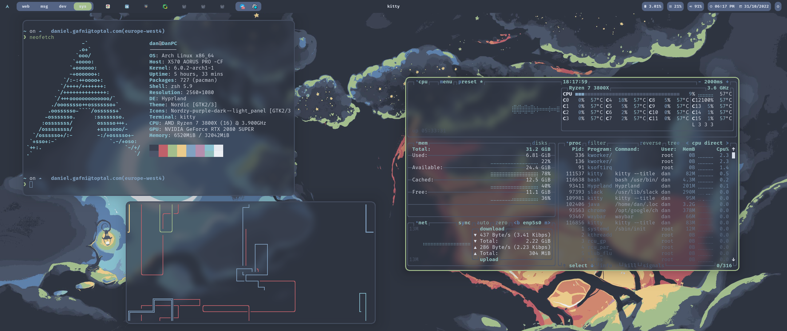

# Dotfiles

This repository contains my personal configuration files for various Linux apps & tools.

The setup is made for Wayland with Hyprland (for Nvidia).

 - zsh  # shell
 - sheldon # shell plugin manager
 - neovim  # text editor
 - alacritty  # terminal emulator
 - kitty  # terminal emulator
 - zellij  # terminal multiplexer
 - starship  # terminal prompt
 - ranger  # terminal-based file manager
 - btop  # resource manager
 - waybar  # bar
 - wofi  # app launcher
 - hyprland  # tiling window manager & compositor
 - hyprpaper  # wallpaper manager
 - wlogout  # power menu
 - swaylock  # screen locker
 - mako  # notification daemon

All the colors & theming are Nord.

# Installation

To install the configuration files, run:

```shell
sh -c "$(curl -fsLS https://chezmoi.io/get)" -- init --apply danielgafni
```
or
```shell
./install.sh
```

To install the system packages, run:

```shell
paru -S zsh neovim kitty bat ranger ranger_devicons-git zellij-git starship-git btop nerd-fonts-fira-code nerd-fonts-complete-starship nordic-theme nordzy-cursors nordzy-icon-theme-git grim-git slurp sway hyprland-nvidia-git hyprpaper-git wlogout-git swayidle swaylock-effects-git wlrobs-hg mako-git waybar-hyprland-git 
```

# Screenshots



# `gaf`

`gaf` is my CLI tool made for running commands related to these dotfiles. It's currently under development.

# Wallpapers

 - [Magic Tree](http://wallpaperswide.com/magical_tree_fantasy_art-wallpapers.html) (converted with the Python tool `image-go-nord`)

 # Troubleshooting notes

 - [Default pulseaudio devices](https://askubuntu.com/questions/14077/how-can-i-change-the-default-audio-device-from-command-line)

