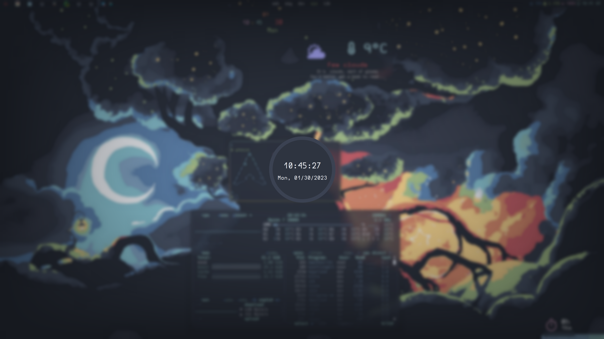
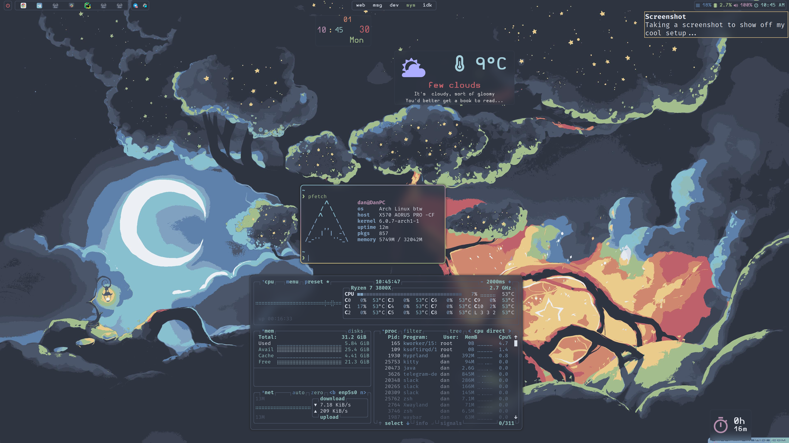

# Dotfiles

This repository contains my personal configuration files for various Linux apps & tools.

This is a Wayland with Hyprland (Nvidia) setup for a single 4k 16:9 monitor.

 - `zsh` - shell
 - `sheldon` - shell plugin manager
 - `neovim`  - text editor
 - `kitty` - terminal emulator
 - `zellij`  - terminal multiplexer
 - `starship` - terminal prompt
 - `ranger` - terminal-based file manager
 - `btop` - resources monitor
 - `waybar` - bar
 - `wofi` - app launcher
 - `hyprland` - tiling window manager & compositor
 - `hyprpaper` - wallpaper manager
 - `wlogout` - power menu
 - `swaylock` - screen locker
 - `mako` - notification daemon
 - `eww` - widgets

All the colors & theming are Nord.

The setup contains some `eww` widgets (like weather, calendar and uptime), they are currently in progress.

# Installation

To install the configuration files, run:

```shell
sh -c "$(curl -fsLS https://chezmoi.io/get)" -- init --apply danielgafni
```
or
```shell
./install.sh
```

Install system dependencies (for Arch Linux):

```shell
paru -S zsh neovim kitty bat ranger ranger_devicons-git zellij-git starship-git btop nerd-fonts-fira-code nerd-fonts-complete-starship nordic-theme nordzy-cursors nordzy-icon-theme-git grim-git slurp sway hyprland-nvidia-git hyprpaper-git wlogout-git swayidle swaylock-effects-git wlrobs-hg mako-git waybar-hyprland-git xdg-desktop-portal xdg-desktop-portal-hyprland-git 
```

It's extremely important to use `xdg-desktop-portal-hyprland-git` as it enables features like screensharing any window or enabling sound for some apps. 

Use the [launcher script](hyprland_nvidia_launcher.sh) script to start Hyprland.

# Screenshots




# `gaf`

[`gaf`](https://github.com/danielgafni/gaf) is my CLI tool made for running commands related to these dotfiles.

# Wallpapers

 - [Magic Tree](http://wallpaperswide.com/magical_tree_fantasy_art-wallpapers.html) (converted with the Python tool `image-go-nord`)

 # Troubleshooting notes

 - [Default pulseaudio devices](https://askubuntu.com/questions/14077/how-can-i-change-the-default-audio-device-from-command-line)


`chronyd`
